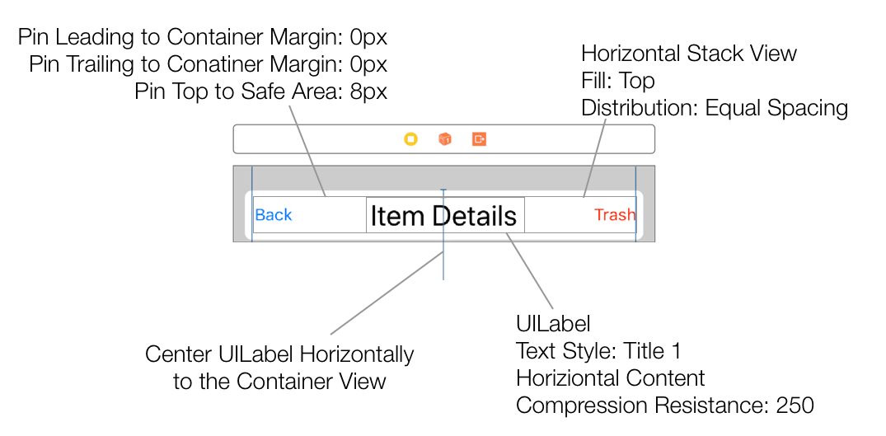
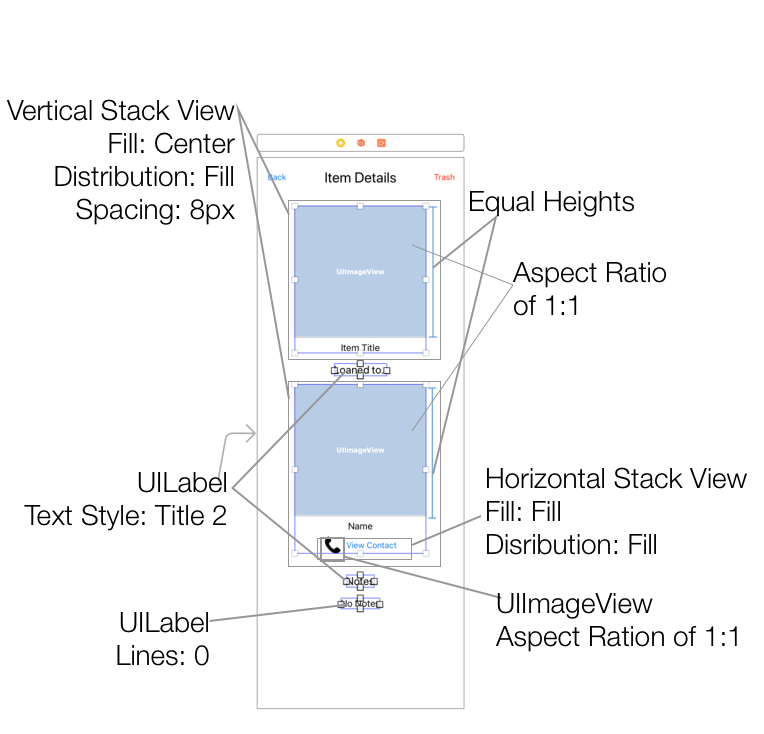
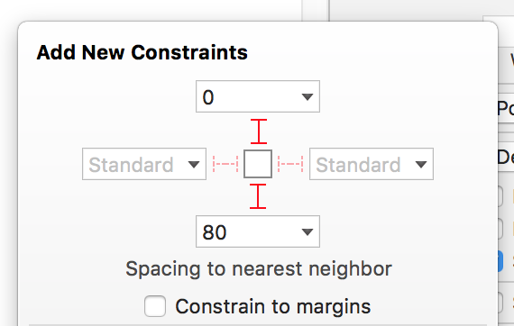
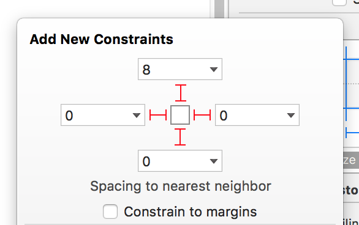
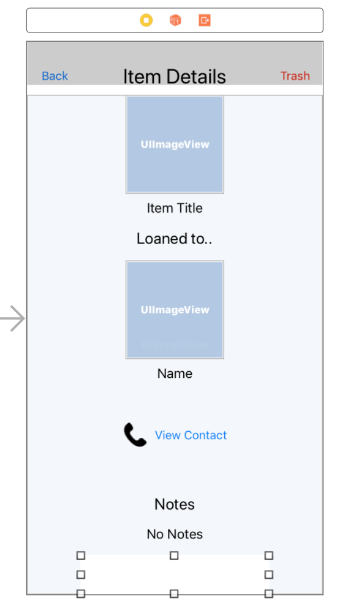
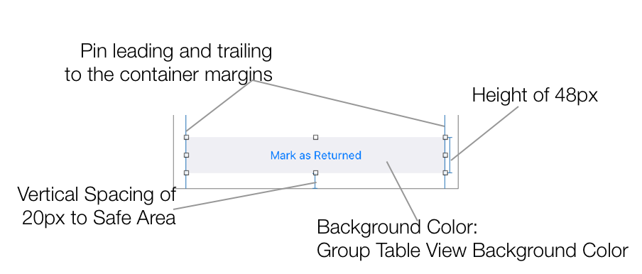

# Some Sample Clone App (2) - Part 2 - Layout Essentials
## More on Constraints
> Topics covered: Constraints, Content Hugging Priority, Content Compression Resistance Priority, Equality constraints, UIStackViews
#### Layout Item Detail View Controller
> final outcome [here](assets/ItemDetailedViewController.png)

1. Recreate the navigation bar

2. Select the `UIViewController` and in the *Size Inspector*
	1. *Simulated Size* from *Fixed* to *Freeform*
	2. *Height* to *700* for an *iPhone 8*
3. Layout Item and Loanee information and notes
	1. Phone Asset [here](assets/phone.png)

4. Add an outer Horizontal Stack view of all *five components*
	1. Fill: Center
	2. Distribution: Fill
	3. Spacing *16px*
	4. Embed in a Scroll View then,
		1. Pin the Outer stack view to the scroll view with the following constraints:

		2. For the same stack view, add these constraints:

		3. Then, pin the scroll view with the following constraints:

		4. Select _both_ the *ScrollView* and the *Outer StackView* that is inside of the stack view and add the following constraints:

		5. Select the *Equal Heights* constraint we just added and set it’s priority from *1000* to *999*
		6. Lastly, select the *Equal Widths* constraint and update the *constant* from *0* to *-32*
		7. For the scroll view, update the *Indicator Insets* *bottom* to *80* in the *Size Inspector*
1. This would work great on a smaller phone but what if the screen was taller than the content inside the scroll view? Like on an iPhone X? So, add the following `UIView` at the *bottom of the outer stack view* to take up that extra vertical space:
	1. Set the view’s Vertical Content Hugging Priority to *249*

#### Add a Floating Button
1. Select the *ScrollView* and in the *Attributes Inspector* uncheck the *Installed* box
2. Add a `UIButton` to the bottom of the view and add the following constraints:

3. Select the ScrollView in the Storyboard Outline and *reinstall* it
4. Be sure the button we just added is at the bottom when you *reinstall* the *scroll view*:

::runable test: view the scroll view scroll and the floating button, well, float :D::

#### Update the view from the selected item and unwind
1. Add the following `@IBOutlets` and `@IBActions` with the following comments. Then, connect the storyboard with the code
```swift
class ItemDetailedViewController: UIViewController {
    ...
    @IBOutlet weak var labelTitle: UILabel!
    @IBAction func pressTrash(_ sender: UIButton) {
        //TODO: prompt user if they are sure they want to delete this item
        //then, unwind from trash
    }

    @IBOutlet weak var imageViewItem: UIImageView!
    @IBOutlet weak var labelItemTitle: UILabel!
    @IBOutlet weak var imageViewLoanee: UIImageView!
    @IBOutlet weak var labelLoaneeName: UILabel!
    @IBAction func pressContactLoanee(_ sender: UIButton) {
        //TODO: present contact view controller
    }

    @IBOutlet weak var labelNotes: UILabel!
    @IBAction func pressMarkAsReturned(_ sender: UIButton) {
        //TODO: unwind from marked as returned
    }
	  ...
}
```
2. Update the `func updateUI()`
```swift
class ItemDetailedViewController: UIViewController {
	  ...
    func updateUI() {

        labelTitle.text = "Item Details"
        labelItemTitle.text = item.itemTitle
        imageViewItem.image = item.itemImage
        if let loanee = item.loanee {
            labelLoaneeName.text = loanee.name
            imageViewLoanee.image = loanee.profileImage
        }

        if item.notes.isEmpty {
            labelNotes.text = "no notes"
        } else {
            labelNotes.text = item.notes
        }
    }
	  ...
}
```
::testable state: see the values from the dummy data populate the view::
4.  In the `ViewController.swift` add the unwind action:
```swift
class ViewController: UIViewController {

    @IBAction func unwindToHome(_ segue: UIStoryboardSegue) {

    }
}
```
3. Back in the storyboard, select the *back button* and create a *segue from the button* to the *exit* of the *ItemDetailedViewController*
	1. In the storyboard outline, select the *unwind segue* and name it *unwind from back*
	2. Create two Manual Segues from the *ItemDetailedViewController* to *Exit*
		1. first segue identifier: *unwind from mark as returned*
		2. Second segue identifier: *unwind from trash*
4. In the *ItemDetailedViewController* update the following *@IBActions*:
```swift
class ItemDetailedViewController: UIViewController {
    ...
    @IBAction func pressTrash(_ sender: UIButton) {
        let alertTrash = UIAlertController(
            title: nil,
            message: "Are you sure you want to delete this item?",
            preferredStyle: .actionSheet
        )

        let actionDelete = UIAlertAction(title: "Delete \(item.itemTitle)", style: .destructive) { (_) in
            self.performSegue(withIdentifier: "unwind from trash", sender: nil)
        }
        alertTrash.addAction(actionDelete)

        let actionCancel = UIAlertAction(title: "Cancel", style: .cancel)
        alertTrash.addAction(actionCancel)

        present(alertTrash, animated: true)
    }
	  ...
    @IBAction func pressMarkAsReturned(_ sender: UIButton) {
        let alertMarkAsReturned = UIAlertController(
            title: "Mark Item as Returned",
            message: "Are you sure you want to mark this item, \(item.itemTitle), as returned from \(item.loanee!.name)?",
            preferredStyle: .actionSheet
        )

        let actionConfirm = UIAlertAction(title: "Mark as Returned", style: .default) { (_) in
            self.performSegue(withIdentifier: "unwind from mark as returned", sender: nil)
        }
        alertMarkAsReturned.addAction(actionConfirm)

        let actionCancel = UIAlertAction(title: "Cancel", style: .cancel)
        alertMarkAsReturned.addAction(actionCancel)

        present(alertMarkAsReturned, animated: true)
    }
	  ...
}
```
5. In the *ViewController.swift* update `func unwindToHome(segue:)`:
```swift
class ViewController: UIViewController {

    @IBAction func unwindToHome(_ segue: UIStoryboardSegue) {
        guard let identifier = segue.identifier else { return }

        switch identifier {
        case "unwind from back":
            print("unwind from back")
        case "unwind from mark as returned":
            print("unwind from mark as returned")
        case "unwind from trash":
            print("unwind from trash")
        default:
            break
        }
    }
}
```
